# MLT Proyek Pertama | Predictive Analysis Project: Regresi untuk Memprediksi Skor Kecanduan Media Sosial pada Siswa
##### Disusun oleh : Diva Anggreini Harahap

## 1. Domain Proyek
Media sosial telah menjadi bagian essensial dari kehidupan sehari-hari terutama bagi remaja dan mahasiswa. Namun, penggunaan media sosial yang berlebihan berpotensi menyebabkan kecanduan yang dapat berdampak negatif pada kesehatan mental, hubungan sosial, dan performa akademik pengguna. Penelitian oleh Sahranç dan Urhun (2021) menyelidiki hubungan antara kecanduan media sosial dan regulasi diri pada mahasiswa. Hasil penelitiaan tersebut menunjukkan bahwa regulasi diri mampu memprediksi tingkat kecanduan media sosial dengan model regresi yang menjelaskan 17% variansi dalam kecanduan tersebut.

Proyek ini berfokus pada pengembangan model regresi prediktif yang mampu memproyeksikan skor kecanduan media sosial berdasarkan data survei mahasiswa. Dengan prediksi yang akurat, institusi pendidikan dan psikolog dapat melakukan intervensi tepat waktu untuk mengurangi risiko kecanduan.

## 2. Business Understanding
### Problem Statements
- Bagaimana cara memprediksi skor kecanduan media sosial menggunakan data survei mahasiswa? 
Permasalahan utama adalah membangun model yang dapat memanfaatkan data survei seperti durasi penggunaan, kondisi mental, dan faktor sosial untuk secara akurat memprediksi tingkat kecanduan. Tantangannya adalah memilih teknik machine learning yang tepat dan mengolah data yang komplkes agar model dapat menangkap pola hubungan antar variabel.

- Variabel mana yang paling berpengaruh dalam memengaruhi tingkat kecanduan?  
Memahami faktor-faktor utama yang memengaruhi kecanduan penting agar intervensi dapat lebih fokus dan efektif. Identifikasi fitur signifikan membantu mengarahkan fokus perhatian pada aspek yang benar-benar berdampak besar, baik dari sisi pencegahan maupun penanganan.

- Seberapa akurat model regresi yang dapat dikembangkan untuk prediksi ini?  
Akurasi model sangat krusial agar hasil prediksi dapat diandalkan sebagai dasar pengambilan keputusan dan intervensi. Perlu dilakukan evaluasi yang tepat dengan metrik yang relevan agar dapat menilai seberapa baik model memprediksi data nyata.

### Goals
- Membangun model regresi yang meminimalisir error prediksi.  
Tujuan utama adalah mendapatkan model yang dapat memberikan prediksi dengan tingkat kesalahan sekecil mungkin, sehingga hasilnya bisa dipercaya dan diimplementasikan dalam konteks nyata.

- Mengidentifikasi fitur utama yang berkontribusi signifikan terhadap skor kecanduan.  
Dengan mengetahui fitur paling berpengaruh, intervensi dan program pencegahan dapat dirancang lebih terfokus dan efisien, serta membantu pemahaman ilmiah tentang kecanduan.

- Menyediakan alat bantu prediktif untuk membantu intervensi dini di lingkungan pendidikan.  
Model ini bukan hanya untuk riset, tetapi juga memiliki tujuan praktis memberikan solusi nyata dalam mengurangi dampak neatif kecanduan media sosial.

### Solution Statements
- Implementasi model Random Forest Regressor dan K-Nearest Neighbor (KNN) Regressor sebagai baseline dan model kompleks.  
Pemilihan dua algoritma berbeda memberikan perbandingan performa antara model yang kompleks dan model sederhana. Random Forest efektif menangkap pola non-linear dan interaksi fitur, sedangkan KNN mudah dipahami dan sering menjadi baseline yang baik.

- Melakukan evaluasi model menggunakan teknik cross-validation agar validasi performa lebih menyeluruh, serta menggunakan metrik RMSE, MAE, dan koefisien determinasi (R²) untuk mengukur akurasi model.  
Cross-validation membantu memastikan model tidak overfit pada satu data training saja dan memberikan gambaran performa yang lebih stabil. Metrik RMSE dan MAE mengukur kesalahan prediksi dalam skala sebenarnya, sedangkan R2 menunjukkan seberapa besar variansi target yang dapat dijelaskan model.

- Melakukan analisis fitur penting (feature importance) untuk mendapatkan insight terkait variabel-variabel yang paling memengaruhi tingkat kecanduan media sosial.  
Feature importance memberikan wawasan yang kritis untuk memahami masing-masing fitur dalam model, serta mendukung pengambilan keputusan berbasis data yang lebih baik.

## 3. Data Understanding
- Dataset didapat dari Kaggle.
- Link : https://www.kaggle.com/datasets/adilshamim8/social-media-addiction-vs-relationships
- Berisi perilaku media sosial siswa dan hasil terkait dalam kehidupan mereka. Dataset ini mencakup beberapa negara dan tingkatan akademik, dengan fokus pada dimensi utama seperti intensitas penggunaan, preferensi platform dan dinamika hubungan. Setiap baris merepresentasikan jawaban satu siswa dalam survei, memberikan gambaran potong lintang yang cocok untuk analisis statistik.
  
### Variabel-Variabel pada dataset:
- Student ID : Identifier unik responden
- Age : Usia (tahun)
- Gender : Jenis kelamin
- Academic_Level : Tingkatan pendidikan
- Country : Negara tempat tinggal
- Avg_Daily_Usage_Hours : Rata-rata jam penggunaan media sosial per hari
- Most_Used_Platform : Platform yang paling sering digunakan
- Affects_Academic_Performance : Dampak yang dilaporkan pada akademik
- Sleep_Hours_Per_Night : Rata-rata jam tidur per malam
- Mental_Health_Score : Penilaian diri terhadap kesehatan mental
- Relationship_Status : status hubungan
- Conflicts_Over_Social_Media : jumlah konflik hubungan akibat media sosial
- Addicted_Score : skor kecanduan media sosial

### Exploratory Data Analysis
- Visualisasi Distribusi Data  
Menggunakan histogram dan boxplot untuk melihat sebara nilai pada setiap fitur numerik sekaligus mendeteksi adanya outlier atau nilai ekstrim yang dapat mempengaruhi hasil model.  
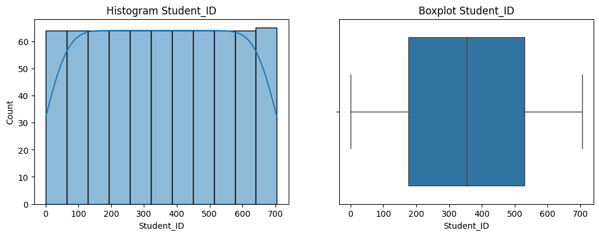

- Analisis Korelasi Antar Fitur  
Membuat correlation matrix dan heatmap untuk mengidentifikasi hubungan linear antar variabel numerik, khususnya untuk memahami fitur mana yang memiliki korelasi signifikan dengan target variabel skor kecanduan.  
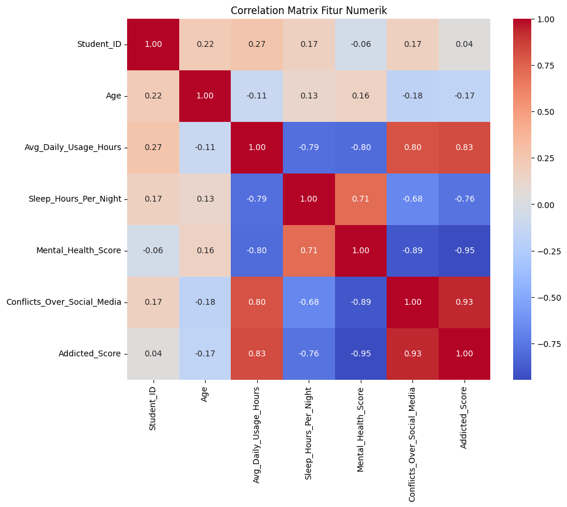

- Visualisasi Kategori dan Fitur Kualitatif  
Menggunakan bar chart untuk melihat distribusi nilai fitur kategorikal. 
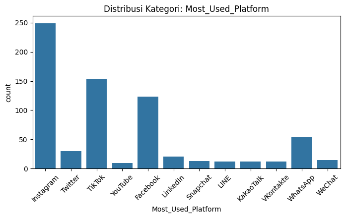
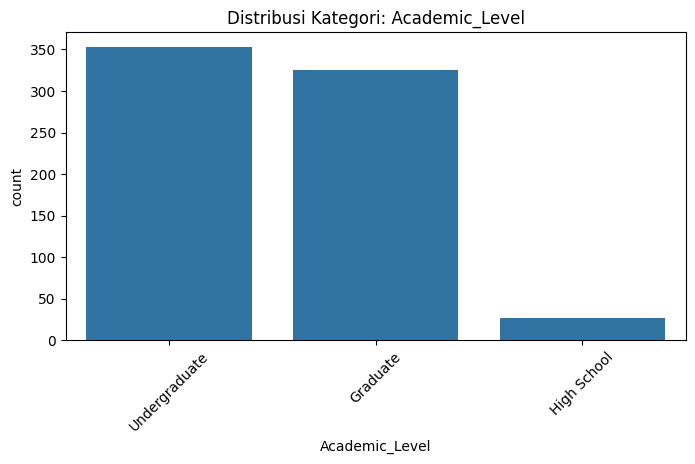
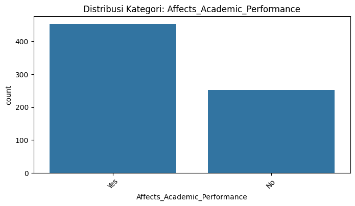

- Deteksi Missing Values dan Data Duplikat
Melakukan pengecekan dan pembersihan data untuk memastikan kualitas dataset, sehingga model yang dibangun dapat lebih akurat dan tidak bias  
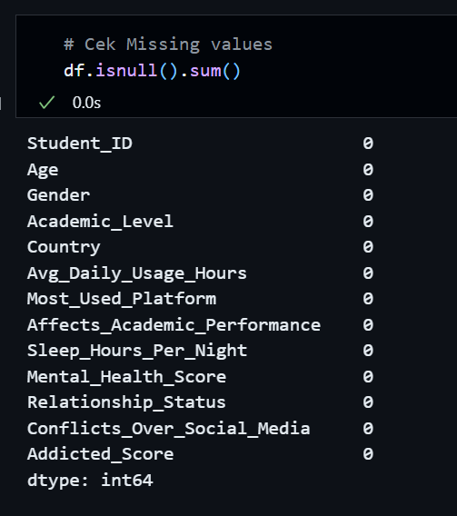
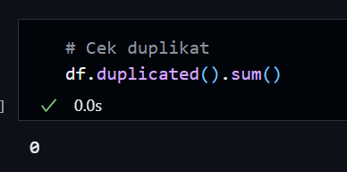

## 4. Data Preparation
- Menghapus data duplikat dan nilai yang hilang. 
Data yang duplikat dapat menyebabkan model belajar dari data yang sama berulang-ulang, sehingga menghasilkan bias dan mengurangi kualitas prediksi. Nilang yang hilang juga dapat mengganggu proses pelatihan model akrena sebagian besar algoritma membutuhkan data lengkap. Karena dataset sudah bersih dari missing values dan data yang duplikat, kita tidak akan melakukan penanganan missing values dan data duplikat. Tapi, kalau dataset banyak missing values dan duplicated data, kita harus menghapus data yang duplikat dan mengatasi missing values (imputasi atau penghapusan) agar dataset menjadi bersih dan siap untuk dianalisis.

- Melakukan encoding kategori dengan Label Encoding 
Algoritma machine learning hanya menerima input numerik. Oleh karena itu, fitur kategorikal harus diubah menjadi angka menggunakan Label Encoding, yang mengganti setiap kategori dengan angka unik. Contohnya : 
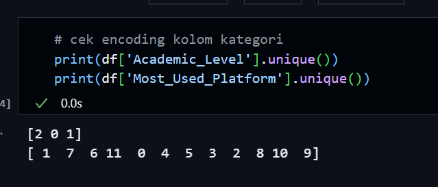

- Melakukan standarisasi fitur numerik menggunakan StandardScaler 
Fitur numerik memiliki skala yang berbeda-beda. Standarisasi mengubah semua fitur menjadi memiliki mean 0 dan standar deviasi 1, agar model tidak bias ke fitur dengan rentang nilai besar dan mempercepat proses konvergensi dalam pelatihan. 
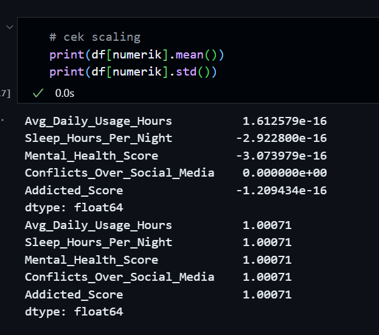

- Memisahkan data menjadi training (80%) dan testing (20%) 
Data dibagi menjadi dua bagian, data training untuk melatih model dan data testing untuk menguji performa model pada data yang belum pernah dilihat. Rasio 80:20 umum digunakan untuk memastikan model memiliki cukup data belajar sekaligus data validasi yang memadai, sehingga evaluasi hasil prediksi lebih objektif.

## 5. Modelling
Pada proyek ini, digunakan dua algoritma machine learning untuk membangun prediksi skor kecanduan media sosial, yaitu **Random Forest Regressor** dan **K-Nearest Neighbors (KNN) Regressor**. Kedua algoritma ini dipilih untuk memberikan perbandingan antara model yang kompleks dna model yang sederhana.

#### Tahapan Pemodelan 
1. Random Forest Regressor 
Model ini menggunakan banyak pohon keputusan yang dibangun secara acak dan hasilnya digabungkan untuk memprediksi nilai target. Dengan parameter default dan random_state=42 untuk reproduktifitas, model ini efektif dalam menangkap pola hubungan kompleks antar fitur dan target tanpa perlu tuning parameter terlebih dahulu.

2. K-Nearest Neighbors (KNN) Regressor 
KNN memprediksi nilai target berdasarkan rata-rata nilai tetangga terdekat dalam ruang fitur. Kelebihan KNN adalah konsepnya yang sederhana dan mudah diimplementasikan, tetapi performanya bisa menurun saat dataset besar atau memiliki fitur berdimensi tinggi.
- Parameter penting adalah jumlah tetangga k (n_neighbors), yang mempengaruhi bias dan varians model.

#### Kelebihan dan Kekurangan
| Algoritma     | Kelebihan                                                | Kekurangan                                                |
| ------------- | -------------------------------------------------------- | --------------------------------------------------------- |
| Random Forest | Mampu menangkap pola non-linear dan interaksi kompleks | Relatif lebih lambat dibanding model sederhana          |
|               | Tahan terhadap overfitting                             | Kurang mudah diinterpretasi dibanding model linear      |
| KNN Regressor | Konsep sederhana dan intuitif                          | Sensitif terhadap dimensi fitur dan skala data          |
|               | Tidak memerlukan pelatihan model eksplisit             | Performa menurun dengan dataset besar atau noise tinggi |

## 6. Evaluation

### Metrik Evaluasi yang Digunakan

Dalam proyek ini, metrik evaluasi yang digunakan untuk menilai performa model regresi adalah:

**Root Mean Squared Error (RMSE)**  
RMSE adalah akar kuadrat dari rata-rata kuadrat selisih antara nilai prediksi dengan nilai aktual. Metrik ini mengukur besarnya error prediksi dalam satuan yang sama dengan target variabel. Nilai RMSE yang lebih kecil menandakan model dengan akurasi prediksi yang lebih tinggi.

_Rumus:_  
RMSE = √( (1/n) × Σ (yᵢ - ŷᵢ)² )  
di mana:  
- yᵢ = nilai aktual  
- ŷᵢ = nilai prediksi  
- n = jumlah sampel

---

**Mean Absolute Error (MAE)**  
MAE menghitung rata-rata nilai absolut selisih antara nilai aktual dan prediksi. Berbeda dengan RMSE, MAE memberikan bobot yang sama pada semua error tanpa memperbesar error besar. Nilai MAE yang rendah menunjukkan model yang prediksinya mendekati nilai sebenarnya.

_Rumus:_  
MAE = (1/n) × Σ |yᵢ - ŷᵢ|

---

**Koefisien Determinasi (R² Score)**  
R² mengukur proporsi variansi data yang dapat dijelaskan oleh model. Nilai R² berkisar antara 0 sampai 1, dengan nilai mendekati 1 menunjukkan model yang sangat baik dalam menjelaskan variasi target.

_Rumus:_  
R² = 1 - ( Σ (yᵢ - ŷᵢ)² ) / ( Σ (yᵢ - ȳ)² )  
di mana:  
- ȳ = rata-rata nilai aktual

---

### Hasil Evaluasi Proyek

Setelah melatih dan menguji model, diperoleh hasil sebagai berikut:

| Model         | RMSE  | MAE   | R²    |
| ------------- | ----- | ----- | ----- |
| Random Forest | 0.148 | 0.058 | 0.978 |
| KNN Regressor | 0.158 | 0.059 | 0.975 |

* **Random Forest** menunjukkan nilai RMSE dan MAE yang lebih kecil dibandingkan KNN, serta nilai R² yang lebih tinggi. Ini menandakan bahwa Random Forest memberikan prediksi yang lebih akurat dan lebih baik dalam menjelaskan variabilitas data skor kecanduan.

* Nilai R² di atas 0.9 untuk kedua model menunjukkan bahwa keduanya cukup mampu menjelaskan variasi skor kecanduan media sosial berdasarkan fitur yang tersedia.

Berikut learning curve sebagai visualisasi evaluasi performa model terkait kemampuan generalisasi.
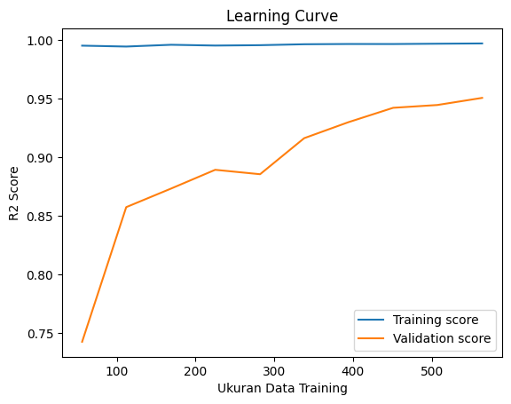
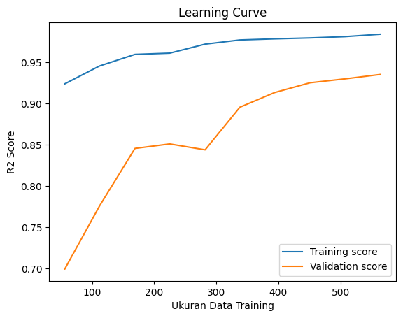

#### Visualisasi Hasil Prediksi vs Aktual
Untuk memahami performa model secara visual, dilakukan plot hasil prediksi terhadap nilai aktual pada data testing. Grafik scatter plot ini menunjukkan seberapa dekat prediksi model dengan nilai sebenarnya.  
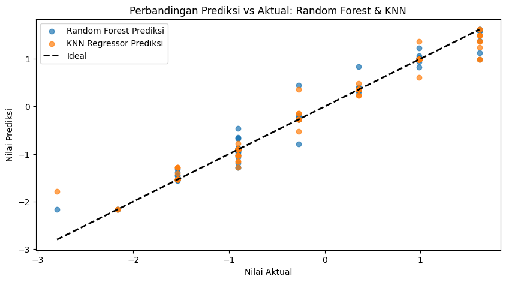
- Titik yang berada di dekat garis diagonal (garis ideal) menandakan prediksi yang akurat.
- Dari visualisasi, model Random Forest memperlihatkan sebaran titik yang lebih rapat ke garis ideal dibanding KNN, menegaskan performa yang lebih baik.

#### Analisis Feature Importance
Untuk mengetahui fitur mana yang paling berpengaruh dalam prediksi skor kecanduan, dilakukan analisis feature importance pada model Random Forest dan KNN Regressor (Permutation Importance)

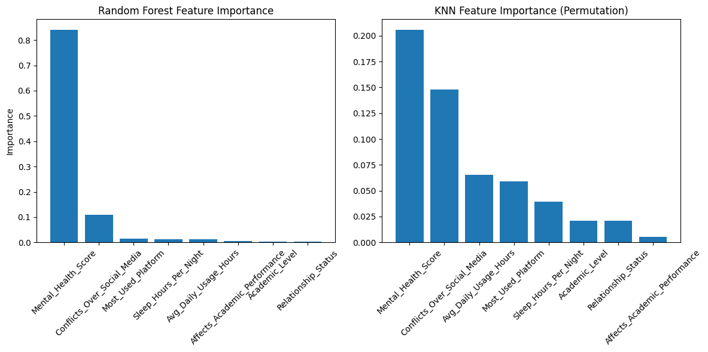

- Fitur dengan nilai importance tinggi menunjukkan kontribusi besar dalam menentukan skor kecanduan.
- Dalam proyek ini, Mental_Health_Score dan Conflicts_Over_Social_Media muncul sebagai fitur utama, menegaskan peran penting kesehatan mental dan konflik sosial dalam kecanduan media sosial.

## 7. Kesimpulan
Proyek ini berhasil mengembangkan model regresi prediktif untuk memprediksi skor kecanduan media sosial pada siswa menggunakan dua algoritma, yaitu Random Forest Regressor dan K-Nearest Neighbors (KNN) Regressor.

Berdasarkan hasil evaluasi menggunakan metrik RMSE, MAE, dan R², model Random Forest menunjukkan performa yang lebih unggul dengan error prediksi yang lebih kecil dan kemampuan menjelaskan variasi data yang lebih tinggi dibandingkan KNN. Nilai R² yang mendekati 1 pada kedua model mengindikasikan bahwa fitur-fitur yang digunakan cukup efektif dalam menjelaskan tingkat kecanduan media sosial.

Analisis feature importance mengungkapkan bahwa skor kesehatan mental `(Mental_Health_Score)` dan jumlah konflik terkait media sosial `(Conflicts_Over_Social_Media)` merupakan variabel paling berpengaruh dalam menentukan skor kecanduan. Temuan ini memberikan insight penting bahwa aspek psikologis dan sosial memiliki peran besar dalam fenomena kecanduan media sosial pada siswa.

Visualisasi learning curve memperlihatkan model Random Forest memiliki kemampuan generalisasi yang baik tanpa tanda-tanda overfitting signifikan. Selain itu, plot prediksi versus nilai aktual memperkuat keunggulan model Random Forest dalam menghasilkan prediksi yang akurat.

Dengan demikian, model Random Forest dapat dijadikan alat bantu prediktif yang efektif untuk mengidentifikasi siswa yang berisiko mengalami kecanduan media sosial. Hal ini memungkinkan institusi pendidikan dan pihak terkait untuk melakukan intervensi dini guna meminimalisir dampak negatif kecanduan tersebut terhadap kesehatan mental dan performa akademik siswa.

Sebagai tindak lanjut, disarankan untuk melakukan pengembangan model dengan hyperparameter tuning dan eksplorasi fitur tambahan agar akurasi dan keandalan prediksi dapat lebih ditingkatkan.

---
## References
Sahranç, Ü., & Urhun, E. (2021). A Study on the Relationship between Social Media Addiction and Self-Regulation Processes among University Students. International Journal of Psychology and Educational Studies, 8(4), 96-109. https://doi.org/10.52380/ijpes.2021.8.4.546 

